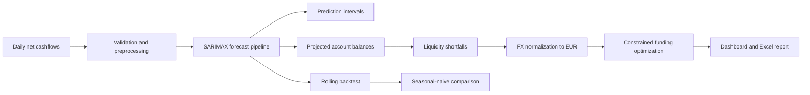

Multi-Currency Liquidity Forecasting

[](https://github.com/Andorta/LiquidityForecasting/actions/workflows/ci.yml)

A Python and Streamlit application that forecasts daily net cashflows, projects
future account balances, identifies liquidity-buffer breaches, and recommends
cross-currency funding subject to treasury constraints.

The project demonstrates an end-to-end analytical workflow: data validation,
time-series forecasting, chronological backtesting, uncertainty estimation,
FX normalization, constrained optimization, reporting, testing, and CI.

> **Data note:** The default dataset is synthetic. It models recurring receipts,
> payroll, month-end payments, operational noise, and occasional liquidity
> shocks. It contains no real company or customer financial data.

## Business problem

Treasury teams need to know whether accounts will remain above required cash
buffers and how limited central funds should be distributed when several
currencies face potential shortfalls.

This application answers four questions:

1. What are the expected net cashflows over the selected forecast horizon?
2. Which currency accounts may breach their minimum liquidity buffers?
3. What are those shortfalls worth in a common base currency?
4. How should available funding be assigned after considering cost and priority?

## Workflow



## Features

- Daily multi-currency net-cashflow forecasting
- SARIMAX models with 95% prediction intervals
- Seasonal-naive fallback when SARIMAX fails or does not converge
- Rolling chronological backtesting
- MAE and MASE evaluation against a seasonal-naive baseline
- Opening balances and configurable minimum liquidity buffers
- Editable demonstration FX rates with EUR as the base currency
- Funding recommendations constrained by:
  - available central funds;
  - projected shortfalls;
  - transfer-cost rates;
  - currency priority weights
- Streamlit dashboard with risk warnings and scenario controls
- Excel reporting
- Automated tests, Ruff checks, and GitHub Actions CI

## Forecasting methodology

Each currency is modeled as a daily univariate time series. The primary model is
SARIMAX with weekly seasonality. Forecasts include a mean estimate and 95%
prediction interval.

If SARIMAX fails to fit or does not converge, the production pipeline uses a
seven-day seasonal-naive fallback and labels the result accordingly.

Forecast performance is assessed with chronological rolling folds. The pipeline
is compared with a seasonal-naive baseline using:

- **MAE:** average absolute forecast error in local-currency units;
- **MASE:** error scaled against an in-sample seasonal-naive forecast.

A MASE below `1.0` indicates improvement over the in-sample naive benchmark.

## Funding optimization

Forecast net cashflows are accumulated from configurable opening balances to
produce projected balances. A shortfall occurs when a projected balance falls
below its minimum buffer.

Shortfalls are converted to EUR using editable demonstration FX rates. SciPy's
linear-programming solver then minimizes a combination of unfunded-liquidity
risk and transfer costs while enforcing:

- total recommendations cannot exceed available central funds;
- funding cannot exceed a currency's projected shortfall;
- recommendations cannot be negative;
- treasury priority weights influence the funding order.

## Input format

CSV and Excel uploads should use a date column followed by one numeric column
per currency. Values represent daily net cashflows in local-currency units.

```csv
Date,EUR,USD,JPY
2025-01-01,1200.00,-450.00,85000.00
2025-01-02,-300.00,900.00,-42000.00
2025-01-03,750.00,125.00,63000.00
```

Requirements:

- dates must be unique and sorted in ascending order;
- at least 60 daily observations are required;
- currency columns must be numeric;
- missing values must be resolved during preprocessing.

Opening balances, minimum buffers, FX rates, transfer costs, priorities, and
available central funds are configured in the dashboard sidebar.

## Installation

Clone the repository and create an isolated environment:

```bash
git clone https://github.com/Andorta/LiquidityForecasting.git
cd LiquidityForecasting
python3 -m venv .venv
source .venv/bin/activate
python -m pip install --upgrade pip
python -m pip install -r requirements-dev.txt
```

On Windows PowerShell, activate the environment with:

```powershell
.venv\Scripts\Activate.ps1
```

## Run the application

Start the dashboard:

```bash
streamlit run app.py
```

Run the command-line workflow:

```bash
python main.py
```

## Quality checks

```bash
ruff check .
ruff format --check .
python -m pytest
```

GitHub Actions runs these checks on Python 3.9, 3.11, and 3.12 for pushes and
pull requests to `main`.

## Excel report

The downloadable workbook contains:

- `Historical_Cashflows`
- `Forecasts`
- `Forecast_Lower_95`
- `Forecast_Upper_95`
- `Projected_Balances`
- `Liquidity_Shortfalls`
- `Funding_Recommendations`

## Project structure

```text
LiquidityForecasting/
├── liquidity_forecasting/
│   ├── allocation.py
│   ├── balances.py
│   ├── data.py
│   ├── evaluation.py
│   ├── export.py
│   ├── fx.py
│   ├── model.py
│   ├── plotting.py
│   └── validation.py
├── tests/
├── .github/workflows/ci.yml
├── app.py
├── main.py
├── pyproject.toml
├── requirements.txt
└── requirements-dev.txt
```

## Limitations

- The default cashflows and FX rates are illustrative, not live market data.
- Forecasts are univariate and do not include known invoices, holidays, or
  macroeconomic variables.
- Prediction intervals estimate model uncertainty but cannot capture every
  operational or market shock.
- Optimization uses the maximum forecast-horizon shortfall for each currency
  rather than scheduling transfers independently by day.
- This project is an analytical demonstration and not financial advice or a
  production treasury-management system.

## Possible extensions

- ingest transactions from a database or treasury API;
- add holiday, invoice, and payment-calendar regressors;
- schedule transfers by date;
- retrieve governed FX rates from an external provider;
- add stress scenarios and forecast-interval coverage metrics;
- deploy a public read-only demonstration dashboard.

## Author

Created by [Andorta](https://github.com/Andorta).
